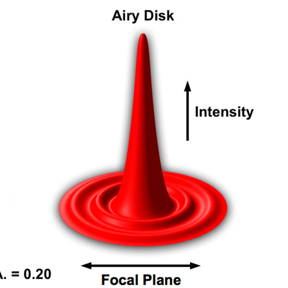
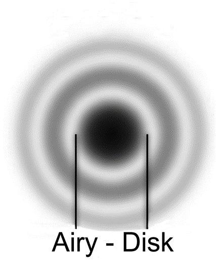
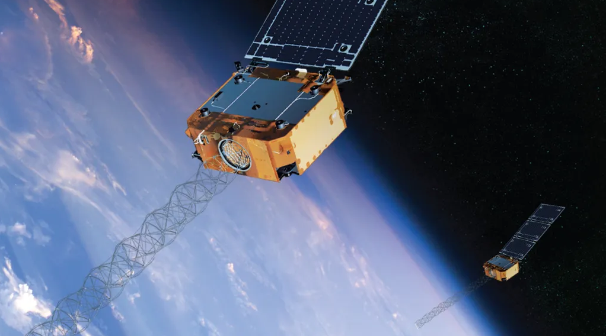
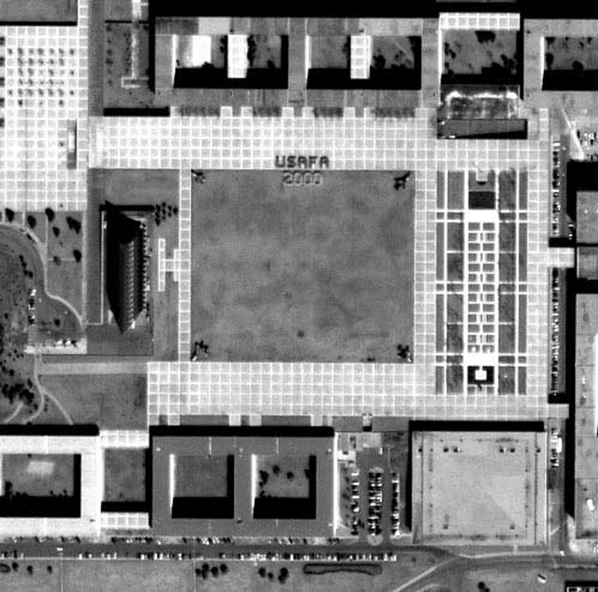
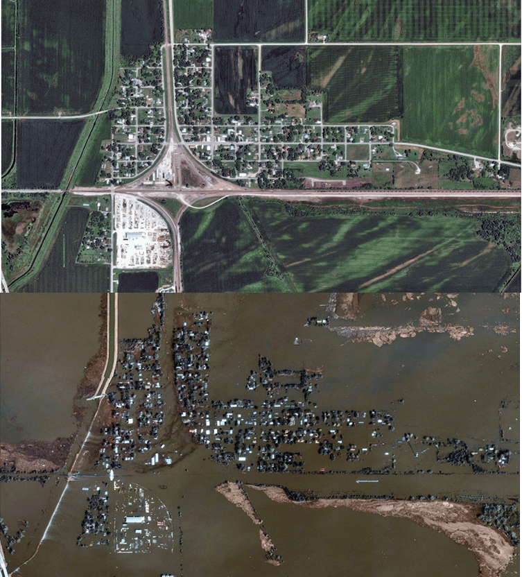
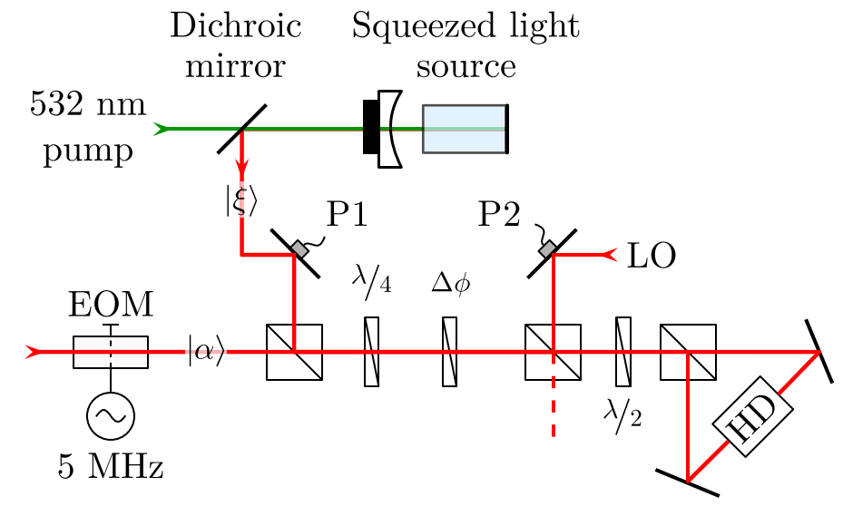

# 09: remote sensing

## quiz

[1]: # (What is the name of the shape below? How is it related to resolution?)

[2]: # (Calculate the diffraction-limited resolution for the visible-light sensor on Planet Labs’ Dove spacecraft. Dove is a 3U Cubesat. Altitude: 475 km. List your assumptions.)

$$
Res = \frac{2.44 \lambda h}{D}
$$

|  |  |
| ------------------------------------------------------------------------------------------------- | ---------------------------------------------------------------------- |

## admin

### quiz answers

### electrical lab

Almost everyone finished!

Discuss data.  

There is a lab on Friday. 

### assignments

- prelab report (individual) due Fri
  - https://www.overleaf.com/read/kfwyrpfyjkmy

## remote sensing

you already know resolution! goals today

- broader view of remote sensing
- know resolution better
- know some real systems

Previously, this lesson was called payloads. Does this title make more sense?

This is a systems engineering class. What do we need first?

#### requirements

- subject
- wavelength(s)
- coverage area
- gaps
- revisit rate

### overview

> Remote sensing is the process of **detecting and monitoring the physical  characteristics of an area by measuring its reflected and emitted  radiation at a distance** (typically from satellite or aircraft). Special  cameras collect remotely sensed images, which help researchers "sense"  things about the Earth. Some examples are:
> 
> - Cameras on satellites and airplanes take images of large areas on  the Earth's surface, allowing us to see much more than we can see when  standing on the ground.
> - Sonar systems on ships can be used to create images of the ocean floor without needing to travel to the bottom of the ocean.
> - Cameras on satellites can be used to make images of temperature changes in the oceans.
> 
> Some specific uses of remotely sensed images of the Earth include:
> 
> - Large forest fires can be mapped from space, allowing rangers to see a much larger area than from the ground.
> - Tracking clouds to help predict the weather or watching erupting volcanoes, and help watching for dust storms.
> - Tracking the growth of a city and changes in farmland or forests over several years or decades.
> - Discovery and mapping of the rugged topography of the ocean floor  (e.g., huge mountain ranges, deep canyons, and the “magnetic striping”  on the ocean floor).
> 
> from [USGS.gov](https://www.usgs.gov/faqs/what-remote-sensing-and-what-it-used)

Need to see

- what
- where
- when

Analysis needed for (remote sensing cannot answer)

- who
- how
- why

## spectrum

$$
c = \lambda f = 2.99792458 \times 10^8 \ \mathrm{m/s}
$$

Wien’s law

$$
\lambda_{max} = \frac{2.898 \ \times 10^{-3}}{T}
$$

## optics

Optical system focuses light/EM radiation onto sensor. Location on sensor depends on object’s location within the telescope’s field of view. 

$$
\mathrm{magnification} = \frac{f}{h} = \frac{r_d}{R}
$$

### diffraction-limited resolution

|  |  |
| --------------------------------------------------------------------------------------------------- | -------------------------------------------------------------------------------------- |

$$
Res = \frac{2.44 \lambda h}{D}
$$

### pixel-limited resolution

$$
Res = \frac{2R}{px}
$$

## subjects

First thought in this class is visible-light imaging spacecraft, but we also sense other things remotely.

### tracking airplanes

How do we track airplanes?

#### Primary radar (PSR—primary surveillance radar)

also called skin track radar

[ASR-9](https://en.wikipedia.org/wiki/Airport_surveillance_radar) airport surveillance radar antenna

(lower curved is reflector is for PSR)

What do these antennas do? 

Consider the shape and movement of the antenna in light of the resolution equation: 

$$
Res = \frac{2.44 \lambda h}{D}
$$

What is this radar system good at?

What is this radar system bad at?

(altitude)

Altitude is important for deconflicting airspace. How can we improve altitude resolution?

#### secondary radar (SSR—secondary surveillance radar)

Top reflector of the [ASR-9](https://en.wikipedia.org/wiki/Airport_surveillance_radar) airport surveillance radar antenna

When interrogated, the aircraft’s transponder replies with 

- 4-digit squawk code 
- altimeter reading

How do you get the additional altitude info? Ask the target. 

Can you make them reply?

1986 Operation El Dorado Canyon—attacking F-111s asked for “wind check” before bombing bases in Libya

#### Automatic Dependent Surveillance–Broadcast (ADS-B)

Requirement in U.S. airspace beginning 2020-01-01

All aircraft must continually transmit

- identification
- position
- altitude
- velocity

Could allow decommissioning of PSRs/SSRs

### tracking ships

marine radar/AIS (Automatic Identification System)

Big ships are tracked with AIS, which continually broadcasts information at approximately 162 MHz for maritime deconfliction and traffic management

- position
- velocity
- identification
- status

VHF range: 10-20 miles—limited by interference and Earth’s curvature

AIS signals can be received in space

Orbcomm receives AIS messages with its constellation of OG2 communication satellites. 

Orbcomm OG2 

- mass: 175 kg
- orbit: 750 km
- spacecraft: 18 (12 functional)

Resolution: 3400 km

Is this a remote sensing spacecraft? Communication spacecraft? 

Cooperative vs non-cooperative vs combative

What can you do if someone turns off their AIS transmitter?

​    tipping and cuing of other surveillance systems

### resolution

classically, a remote sensing lesson covers resolution

What do you know about resolution? What is it? Which is better, bigger or smaller?

- $ Res=\frac{2.44 \lambda h}{D}$
- HD: 1920 x 1080
- Canon EOS R6: 20 MP
- Apple Retina display

> **resolution**
> 
> the smallest interval [measurable](https://www.google.com/search?client=firefox-b-1-d&sa=X&sca_esv=562371431&biw=1468&bih=793&sxsrf=AB5stBhRirgKRaYNYEZAq4eVNPtXt4ulUA:1693771425006&q=measurable&si=ACFMAn9-5A9OMKPWcg180I9o9MndJuk7StA-r0Nd3r1VpzlBxaS-jhUiyKBx923vEnSjKqNHSXgnYdC7Jgzork5_KyoG09euWg%3D%3D&expnd=1) by a scientific (especially optical) instrument; the [resolving](https://www.google.com/search?client=firefox-b-1-d&sa=X&sca_esv=562371431&biw=1468&bih=793&sxsrf=AB5stBhRirgKRaYNYEZAq4eVNPtXt4ulUA:1693771425006&q=resolving&si=ACFMAn8hzZSJQsgXIYlkGc-z1vmpLzzqDb-HYA4Uzs8LHMyf4RUfQLskl7sb9mRXEdy6ujQUiSElCOVlpDx7Wea71hZH8miEkQ%3D%3D&expnd=1) power.
> 
> - the degree of detail visible in a photographic or television image.
>   
>   "a high-resolution monitor"
> 
> -[Google](https://www.google.com/search?client=firefox-b-1-d&sca_esv=562371431&sxsrf=AB5stBg7ExTFwPB-Wa67SGv4uuDN6e6kZg:1693771420248&q=resolution&si=ACFMAn-S_tFEbe5J-h2tG_x3DZ9e92yWcGP7rb3n1HUpTqqdaE-dCInGGlwX8_O3Y9CiviHXrfN_4APdt5TY7KFvsU12iHyDBxKhwH7z1UlQZBi7KRJPSMc%3D&expnd=1&sa=X&ved=2ahUKEwjhpNaeno-BAxX5AjQIHcAgDGEQ2v4IegUIIBDdAQ&biw=1468&bih=793&dpr=1.25)

> **resolution**
> 
> 7. Optics. the act, process, or  capability of distinguishing between two separate but adjacent objects  or sources of light or between two nearly equal wavelengths.: Compare [resolving power](https://www.dictionary.com/browse/resolving-power). 
> 
> **resolving power**
> 
> 1. Optics. the ability of an optical device to produce separate images of close objects.
> 2. Photography. the degree to which a lens or photographic emulsion is able to define the details of an image.
> 
> -[Dictionary.com](https://www.dictionary.com/browse/resolution)

#### types of resolution

##### spatial

##### spectral

##### radiance

##### temporal

Digital Globe images of Pacific Junction, Iowa (Mar 2019)

##### phase

useful for interferometry

#### spatial resolution

## homework

- by Friday
  - camera prelab report